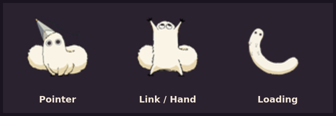

# Brushbuddy → Hyprcursor

*A fluffy little Brushbuddy in a witch hat, tagging along with your pointer instead of Coco's ink. 🐾*

A custom animated cursor theme for Hyprland, built from "Brushbuddy" — a
*Witch Hat Atelier*-themed Windows cursor pack (`.cur`/`.ani`) by
[Korada_art](https://www.instagram.com/korada_art) — merged into a
Bibata-Modern-Ice base so only the default pointer, link/hand pointer,
wait/loading, and all 12 resize-direction cursors are replaced — everything
else (text cursor, crosshair, etc.) stays exactly as Bibata ships it.

**Status: v0.9** — all 18 shapes confirmed working at multiple cursor sizes,
a self-contained installer/uninstaller with rollback, and the cursor theme
now survives a reboot on every Hyprland session-launch method (UWSM,
classic `hyprland.conf`, and CachyOS's Lua config wrapper). See
`docs/CHANGELOG.md` for the full debugging journey (there were some real
bugs along the way, documented rather than hidden).

## Preview

<p align="center">
  
</p>

See it animated in motion: [showcase reel on Instagram](https://www.instagram.com/reel/Db_eJl7t76R/).

## Install

```bash
git clone <this repo>
cd brushbuddy-hyprcursor-theme
./install.sh
```

The installer:
- Detects your environment (Hyprland, GTK 3/4, UWSM, classic `hyprland.conf`,
  CachyOS's Lua config wrapper, gsettings, Flatpak) and tells you what it
  found and what it's skipping
- Writes the cursor choice to every persistence path that applies (UWSM env,
  classic `hyprland.conf`, CachyOS's Lua wrapper, GTK) so it survives a
  reboot no matter how your session is launched — see the "Cursor didn't
  survive a reboot" note in `docs/CHANGELOG.md` (v0.9) for why this matters
- Backs up your current cursor settings **before** touching anything
- Walks you through cursor sizes **one at a time, live** — it won't move to
  the next size until you explicitly confirm you're happy with the current
  one (`y`/`b`igger/`s`maller/`l`ist/`q`uit)
- Applies everything (Hyprland env, GTK, gsettings, current session) only
  after you've confirmed a size

No compiler, no Python, no `hyprcursor-util` needed — the theme ships
precompiled in `release/Brushbuddy-Bibata/`. Those tools are only needed if
you want to rebuild the theme from source (see "Rebuilding from source"
below).

Non-interactive options:

```bash
./install.sh --size 32       # skip the wizard, install straight at 32px
./install.sh --no-gtk        # don't touch GTK settings.ini / gsettings
./install.sh --dry-run       # show what would happen, change nothing
./install.sh --flatpak-support  # also grant Flatpak apps read access to the theme
```

Re-running `./install.sh` later (e.g. to pick a different size) reuses your
*original* pre-Brushbuddy backup rather than overwriting it with Brushbuddy's
own settings — so uninstall still restores your actual original cursor no
matter how many times you resize.

## Uninstall

```bash
./uninstall.sh
```

Restores whatever cursor theme and size were active before you ran
`install.sh` — Hyprland env, GTK, gsettings, current session — and removes
the Brushbuddy theme files.

## Repo layout

```
install.sh          Installer (detection, backup, size wizard, live apply)
uninstall.sh         Restores your previous cursor and removes Brushbuddy
release/
  Brushbuddy-Bibata/  Precompiled theme -- what install.sh actually installs
originals/           The 6 source Windows cursor files (3 static .cur, 3 animated .ani)
working-state/        Hyprcursor "working-state" source for all 18 patched shapes
                       (left_ptr, hand1, hand2, link, left_ptr_watch, wait, plus 12
                       resize-direction shapes) -- each with an explicit six-size
                       define_size ladder (24/32/48/64/96/256px) per animation frame
tools/                 Scripts to rebuild/test/patch the theme from source
docs/
  FACTCHECK.txt        Raw source-file analysis (frame counts, timing, header quirks)
  FORMAT_NOTES.md       What we learned about the hyprcursor format the hard way
  CHANGELOG.md          Version history / debugging journey, v0.1 → v0.8
```

## Rebuilding from source

Only needed if you're modifying the theme, not for a normal install.
Requires `hyprcursor-util` (from the `hyprcursor` package) and Python 3.

```bash
# 1. Extract your own installed Bibata-Modern-Ice into working-state form
hyprcursor-util --extract ~/.local/share/icons/Bibata-Modern-Ice \
    --output /tmp/bibata-extracted

# 2. Patch a copy with the Brushbuddy shapes from this repo
python3 tools/patch_bibata.py \
    /tmp/bibata-extracted/extracted_Bibata-Modern-Ice \
    /tmp/Brushbuddy-Bibata-working \
    --apply
# (patch_bibata.py reads Brushbuddy source frames from its sibling
#  extracted/{classic,pointer,wait}/ directory -- see tools/patch_bibata.py
#  header for the exact layout it expects)

# 3. Rename the copy's identity so it doesn't claim to be Bibata
sed -i 's/^name = .*/name = Brushbuddy-Bibata/' /tmp/Brushbuddy-Bibata-working/manifest.hl

# 4. Validate, then compile
python3 tools/validate_theme.py /tmp/Brushbuddy-Bibata-working
hyprcursor-util --create /tmp/Brushbuddy-Bibata-working --output /tmp/Brushbuddy-Bibata-build

# 5. Copy the compiled output into release/ to update what install.sh ships
cp -a /tmp/Brushbuddy-Bibata-build/theme_Brushbuddy-Bibata release/Brushbuddy-Bibata
```

Testing tools (`build_stage.sh`, `safe_test.sh`) compile a working-state tree
and install it under a scratch theme name with an **automatic revert** after
N seconds — used for every live test during development so a bad build never
leaves the cursor broken for long.

**Important if testing manually with `hyprctl setcursor`:** move the mouse
afterward. Hyprland does not appear to redraw the cursor sprite purely
because the theme changed underneath it — only on the next move/hover event.
See `docs/FORMAT_NOTES.md`.

## Credits

<p align="center">
  <br>
  <strong>Korada_art</strong> — <a href="https://www.instagram.com/korada_art">@korada_art on Instagram</a>
</p>

- Cursor art: "Brushbuddy", a *Witch Hat Atelier*-themed Windows cursor pack
  (`.cur`/`.ani`) by [Korada_art](https://www.instagram.com/korada_art) —
  go give them a follow, they deserve it
- Reverse-engineering the hyprcursor format, the installer/uninstaller, and a
  lot of very patient live testing: Ace

## Found a bug?

`docs/CHANGELOG.md` is basically a bug diary already — cursors gone
invisible, hotspots drifting, a whole reboot-persistence saga — so don't be
shy about adding to it. If something's off (a shape looks wrong, a size
won't apply, the installer trips on your setup), please
[open an issue](https://github.com/abrahandejesusaparicio-code/brushbuddy-hyprcursor-theme/issues).
Include your distro, how you launch Hyprland (UWSM / classic
`hyprland.conf` / something else), and whatever `./install.sh` printed —
that's usually enough to track it down.
